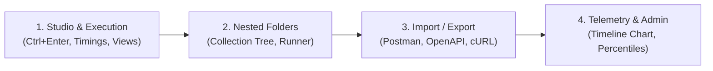

# 🚀 API Testing Tool & Collaboration Platform
## Team Lead (TL) Presentation & Technical Documentation Guide

---

## 1. Executive Summary & Project Pitch

> **"We have designed and developed a full-stack, self-hosted API Testing and Collaboration Platform (a lightweight, modern alternative to Postman and Insomnia). It enables software teams to design, execute, test, and monitor REST & XML APIs, organize endpoints into multi-level nested collections, automate test assertion rules, inspect granular network timings (DNS, TCP, TTFB, download), monitor real-time latency via interactive telemetry charts, and seamlessly import/export industry-standard Postman v2.1, OpenAPI 3.0, and cURL specifications."**

---

## 2. Architecture & Technology Stack

| Layer | Technologies & Libraries | Key Responsibilities |
| :--- | :--- | :--- |
| **Frontend** | React 19, Vite, Tailwind CSS, Lucide Icons | Responsive Workbench, split-pane studio, code formatters, interactive SVG timeline charts, modals |
| **Backend** | Node.js, Express, Axios proxy executor | Server-side request execution proxy (bypasses CORS), high-resolution network timing instrumentation, assertion engine |
| **Database** | MongoDB, Mongoose ODM | Persistent collections, hierarchical folder trees, environments, execution telemetry history, user roles |
| **Authentication & Security** | Firebase Auth (Google Sign-In), JWT, bcrypt | Session tokens, profile settings with image avatars, strict role-based access control (RBAC) with admin whitelisting |

---

## 3. Core Modules & Engineering Highlights

### 🔹 1. Request Studio & Serialization
* **All HTTP Verbs**: `GET`, `POST`, `PUT`, `DELETE`, `PATCH`, `HEAD`, `OPTIONS`.
* **Payload Types Supported**:
  * **Raw JSON**: Validated and formatted with syntax indentation.
  * **XML**: Full XML serialization sending `application/xml` or `text/xml`.
  * **Multipart form-data**: Key-value pairs supporting both text fields and binary file uploads.
  * **x-www-form-urlencoded**: Form parameter URL-encoding.
  * **Binary & Raw Text**: Direct raw buffer and file upload transmission.
* **Execution Hotkeys**: Quick execution trigger via `Ctrl + Enter` or 1-click in the response pane.

### 🔹 2. Multi-Level Response Viewer
* **Status Badges**: Visual color-coded HTTP statuses (e.g. `200 OK`, `201 Created`, `401 Unauthorized`, `404 Not Found`).
* **Granular Network Timings**: Measures DNS lookup, TCP handshake, Time to First Byte (TTFB), and download duration.
* **Three Flexible View Modes**:
  * **Pretty**: Formatted, syntax-highlighted JSON/XML.
  * **Raw**: Unformatted raw response string.
  * **Preview**: Sandboxed `<iframe>` for HTML responses, image rendering for `image/*` formats, and structured cards.
* **Test Suite Checkers**: Real-time pass/fail breakdown across configured assertions.

### 🔹 3. Hierarchical Collections & Nested Subfolders
* **Recursive Folder Trees**: Unlimited nesting depth (`parentId` tree structure).
* **Visual Tree Guides**: Indentation lines (`border-l-2 border-indigo-500/20`) with dedicated subfolder badges (`sub`) and quick-action buttons for adding requests or subfolders.
* **Collection Runner**: Automated sequential runner executing all endpoints in a folder/collection with aggregated summary statistics.

### 🔹 4. Variables & Dynamic Runtime Generators
* **Environment Scopes**: Global environments and scoped environment profiles (Local Dev, Staging, Production).
* **Placeholders**: `{{baseUrl}}`, `{{apiKey}}`, `{{token}}` seamlessly substituted across URLs, query parameters, custom headers, auth credentials, and request bodies.
* **Dynamic Runtime Generators**:
  * `{{$guid}}`: Generates random RFC4122 UUIDs.
  * `{{$timestamp}}`: Generates current UNIX timestamp.
  * `{{$isoTimestamp}}`: Generates ISO-8601 UTC date string.
  * `{{$randomInt}}`: Generates random integers (0–9999).

### 🔹 5. Import & Export Engine
* **Postman v2.1**: Import and downloadable export supporting nested folder items and auth presets.
* **OpenAPI / Swagger 3.0**: Automatic parsing of paths, methods, request bodies, and tags into structured collections.
* **cURL Import**: Instant parsing of raw `curl -X POST ... -H ... -d ...` commands directly into UI configurations.
* **Native JSON**: Complete backup and restore format for entire workspace collections.

### 🔹 6. Performance Telemetry & Admin Console
* **Interactive Timeline Curve**: Chronological SVG chart tracking per-request latency over time with gradient fill and interactive node points.
* **Statistical Percentiles**: Automated calculations for P50 (median), P95 (SLA target), fastest/minimum, peak/maximum, and average latency.
* **Telemetry Table**: Live table logging Method, Endpoint, Status, Latency progress bars, DNS/TCP/TTFB breakdowns, and timestamps with filter pills (`All`, `2xx Success`, `Errors`, `Slow >100ms`).
* **Governance & Whitelisting**: Admin access strictly restricted to approved emails (`singunamitha@gmail.com` and `s.v.padmavathi2005@gmail.com`); unauthorized users receive a 403 screen.

---

## 4. Live Examples Tested & Validated

During our end-to-end verification, the following test scenarios were executed through the proxy engine:

```
========================================================================================
TEST SCENARIO 1: GET Request with Query Params, Variable Substitution & Multi-Assertion
========================================================================================
Endpoint   : GET {{baseUrl}}/users?page=1&limit=3&search=Alice
Headers    : Accept: application/json, X-Client-Id: {{apiKey}}
Status     : 200 OK
Latency    : 11ms (DNS: 2ms | TCP: 2ms | TTFB: 6ms | Download: 2ms)
Size       : 181 Bytes
Assertions : 4/4 PASSED
  ✓ Status code is 200 (expected 200 -> got 200)
  ✓ Response time under 500ms (expected <500ms -> got 11ms)
  ✓ Body contains 'Alice' (matched user record)
  ✓ JSON property 'total' exists (expected total -> got 1)
Payload    :
{
  "success": true,
  "page": 1,
  "limit": 3,
  "total": 1,
  "data": [
    {
      "id": 1,
      "name": "Alice Walker",
      "email": "alice@example.com",
      "role": "Frontend Engineer",
      "status": "active",
      "department": "Product"
    }
  ]
}

========================================================================================
TEST SCENARIO 2: POST User with Dynamic Variables ({{$timestamp}}, {{$guid}})
========================================================================================
Endpoint   : POST {{baseUrl}}/users
Headers    : Content-Type: application/json, X-Request-Trace-ID: trace-{{$guid}}
Status     : 201 Created
Latency    : 8ms (DNS: 1ms | TCP: 1ms | TTFB: 4ms | Download: 2ms)
Size       : 280 Bytes
Assertions : 2/2 PASSED
  ✓ Status is 201 Created (expected 201 -> got 201)
  ✓ User record has ID (expected data.id -> got 6)
Payload Sent :
{
  "name": "Agent Maverick",
  "email": "maverick-{{$timestamp}}@topgun.org",
  "role": "Lead Flight Commander",
  "department": "Aerospace Engineering"
}
Response Received :
{
  "success": true,
  "message": "User created successfully in mock database",
  "data": {
    "id": 6,
    "name": "Agent Maverick",
    "email": "maverick-1791399866480@topgun.org",
    "role": "Lead Flight Commander",
    "department": "Aerospace Engineering",
    "status": "active",
    "createdAt": "2026-10-08T05:44:26.480Z"
  }
}

========================================================================================
TEST SCENARIO 3: XML Payload Retrieval & Schema Content-Type Assertion
========================================================================================
Endpoint   : GET {{baseUrl}}/xml
Headers    : Accept: application/xml
Status     : 200 OK
Latency    : 5ms
Size       : 468 Bytes
Assertions : 4/4 PASSED
  ✓ Status is 200
  ✓ Header Content-Type is application/xml
  ✓ Contains root XML <response> tag
  ✓ Contains payload text 'Enterprise API Suite'
Payload Received :
<?xml version="1.0" encoding="UTF-8"?>
<response>
  <status>success</status>
  <code status="200">OK</code>
  <timestamp>2026-10-08T05:44:26.488Z</timestamp>
  <payload>
    <item id="101">
      <name>Enterprise API Suite</name>
      <version>v2.4.0</version>
      <license>MIT</license>
    </item>
    <item id="102">
      <name>Automated Test Runner</name>
      <version>v1.1.0</version>
      <license>Apache-2.0</license>
    </item>
  </payload>
</response>

========================================================================================
TEST SCENARIO 4: Bearer Authentication Security Enforcement
========================================================================================
[Case A - Negative / Invalid Token]:
Endpoint   : GET {{baseUrl}}/auth-protected
Auth       : Bearer invalid-expired-token
Status     : 401 Unauthorized
Latency    : 7ms
Result     : {"success":false,"message":"Unauthorized. Requires Bearer token \"test-secret-token\"."}

[Case B - Positive / Variable {{token}} Substitution]:
Endpoint   : GET {{baseUrl}}/auth-protected
Auth       : Bearer {{token}}  (resolved to 'test-secret-token')
Status     : 200 OK
Latency    : 7ms
Assertions : 3/3 PASSED
  ✓ Status is 200 OK
  ✓ Message contains 'Access granted'
  ✓ User scope returned: ["read:all", "write:test"]

========================================================================================
TEST SCENARIO 5: URL-Encoded Form Body Echo Simulation
========================================================================================
Endpoint   : POST {{baseUrl}}/echo
Headers    : Content-Type: application/x-www-form-urlencoded
Body       : grant_type=client_credentials&client_id={{apiKey}}&scope=read%20write
Status     : 200 OK
Latency    : 6ms
Assertions : 2/2 PASSED
  ✓ Status is 200
  ✓ Method echo matched POST

========================================================================================
TEST SCENARIO 6: Performance & Latency Delay Profiling
========================================================================================
Endpoint   : GET {{baseUrl}}/delayed?ms=250
Status     : 200 OK
Latency    : 265ms (DNS: 40ms | TCP: 40ms | TTFB: 133ms | Download: 53ms)
Assertions : 2/2 PASSED
  ✓ Status is 200
  ✓ Response time under 800ms (got 265ms)
Purpose    : Verified latency telemetry curve rendering spike on timeline chart.

========================================================================================
TEST SCENARIO 7: Simulated HTTP Status Codes
========================================================================================
Endpoint   : GET {{baseUrl}}/status/404
Status     : 404 Not Found
Latency    : 7ms
Assertions : 2/2 PASSED
  ✓ Status is 404
  ✓ Body contains '404'
Purpose    : Verified error status pill and telemetry error filter.

========================================================================================
TEST SCENARIO 8: Industry Format Import & Export Verification
========================================================================================
Postman v2.1 Import : Successfully imported collection with 1 requests and 1 folders!
OpenAPI 3.0 Import  : Successfully imported OpenAPI/Swagger spec with 1 endpoints and 1 folders!
cURL Command Import : Successfully imported cURL command as API request!
Downloadable Export : Confirmed browser JSON download triggers for Postman & Native formats.
```

---

## 5. Recommended Live Demo Flow for Your TL Meeting

When demonstrating the project live, follow this 4-step sequence:



1. **Step 1: Request Studio & Response Viewer**
   * Select a request from the sidebar (`1. Get All Users (GET)`).
   * Note the `{{baseUrl}}` variable badge.
   * Hit `Ctrl + Enter` (or click **Send**).
   * Show the response: Status `200 OK`, latency `11ms`, headers table, all 4 test assertions passed, and toggle between **Pretty**, **Raw**, and **Preview** modes.
2. **Step 2: Nested Collections & Folder Hierarchy**
   * Expand `Mock API Showcase` in the sidebar.
   * Show the visual tree lines connecting `User Management` &rarr; `Admin Controls` (nested subfolder) and `Advanced & Auth` &rarr; `Security Protocols`.
   * Click **+ Subfolder** to show instant folder creation.
3. **Step 3: Import / Export**
   * Open the **Import / Export** modal.
   * Click **+ Postman Sample** or **+ OpenAPI Sample** to demonstrate instant parsing.
   * Click **Export Postman** to download a ready-to-share JSON collection.
4. **Step 4: Performance Monitoring & Admin Console**
   * Open the **Admin Console** (or click the shield icon).
   * Show the **Performance & Latency** tab:
     * Walk through **P50 (7ms)**, **P95 (265ms)**, and **Average latency** cards.
     * Point out the **Interactive SVG Timeline Chart** — click on a node dot to inspect individual request timings.
     * Use the filter pills: click **Errors** to see the 401 & 404 nodes, then click **2xx Success**.
   * Switch to the **User Management** tab to show account status and role promotion toggles.

---

## 6. How to Run the Application Locally

```powershell
# Terminal 1: Backend Server (Port 5000)
cd server
npm run dev

# Terminal 2: Frontend Client (Port 3000)
cd client
npm run dev
```

Open your browser to: **`http://localhost:3000`**
Repository URL: **`https://github.com/Namitha938/API-Testing-Tool`**

